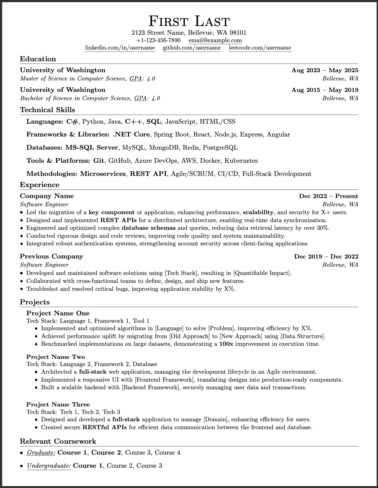

# sudo-resume

> A clean, minimal, and ATS-friendly LaTeX resume template for software engineers.


This template is based on "Sourabh Bajaj's" overleaf template but refactored for easier customization and strict & modern ATS (Applicant Tracking System) parsing.

This template has been tested against **[Open Resume](https://www.open-resume.com/)**, a modern, open-source ATS parser.

The validation confirms that **100% of the content**—including contact details, skills, and work history — is extracted correctly and structured properly.

### Proof of Results
I have included screenshots of the verification process in the [`results/`](./results) directory. You can inspect them to see how the parser "sees" this resume compared to the PDF.

## Preview



## Features

* **ATS Optimized:** Uses standard fonts and structure that parsers can read easily.
* **One Page Focus:** Designed to keep content dense but readable.
* **Modular:** Easy to comment out sections you don't need.
* **No Bloat:** Pure LaTeX, no heavy custom packages required & no icons.

## Quick Start

### Option 1: Overleaf (Easiest)
1.  Download `resume.tex`.
2.  Upload it to a new project on [Overleaf](https://www.overleaf.com/).
3.  Set compiler to **pdfLaTeX**.

### Option 2: Local Build
Ensure you have a TeX distribution installed (TeX Live, MacTeX, or MiKTeX).

```bash
# 1. Clone the repository
git clone https://github.com/adit0717/sudo-resume.git

# 2. Navigate to directory
cd sudo-resume

# 3. Compile the resume
pdflatex resume.tex